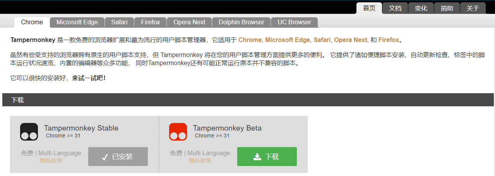
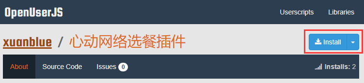
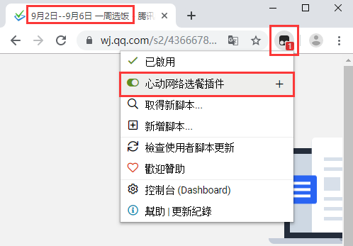
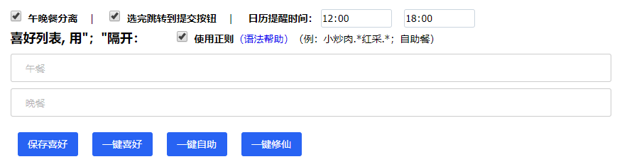

# 心动网络选餐辅助脚本
为心动网络内部每周选餐提供便捷个性化的选餐协助。

基于 Tampermonkey，在 @xiedi 的 "选饭" 脚本基础上加工丰富而来，本脚本有大量使用"选饭"脚本的思路及源码。感谢作者的创造性开发！

"选饭" 脚本地址：https://greasyfork.org/zh-CN/scripts/372414-%E9%80%89%E9%A5%AD

### 功能特性

* “一键喜好” 自定义个人喜好，根据喜好顺序个性化选餐。支持普通文本和正则模式
* “一键自助” 一键选择自助餐
* “一键不吃” 一键修仙
* “导出文本” 将本次选餐信息以文本格式导出下载
* “导出日历” 将本次选餐信息以日历文件导出下载，方便导入日历软件查看
* 基于Tampermonkey的特性，支持多平台多浏览器
* 下载安装后的脚本本地用户可轻易编辑修改，自定义功能

### 安装使用
1、为本地浏览器安装 Tampermonkey 插件，[点击官网下载](https://www.tampermonkey.net/index.php?ext=dhdg)

2、安装启用本脚本。
* [点击从OpenUserJS脚本库安装](https://openuserjs.org/scripts/xuanblue/%E5%BF%83%E5%8A%A8%E7%BD%91%E7%BB%9C%E9%80%89%E9%A4%90%E8%84%9A%E6%9C%AC)（推荐）

* [直接从此库下载](./心动网络选餐脚本.user.js)，手动安装

3、用安装好脚本的浏览器打开每周订餐问卷页面，脚本会自动识别，添加扩展功能

### 意见反馈
欢迎各位使用者提供意见反馈，将不定期更新维护

### License
[MIT](./LICENSE)
