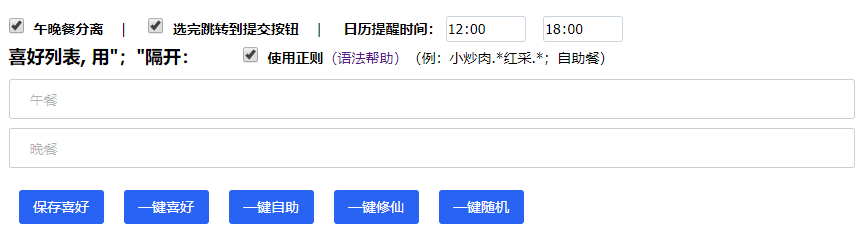

# 心动网络选餐辅助脚本
为心动网络内部每周选餐提供便捷个性化的选餐协助。

基于 Tampermonkey，在 @xiedi 的 "选饭" 脚本基础上加工丰富而来，本脚本有大量使用"选饭"脚本的思路及源码。感谢作者的创造性开发！

"选饭" 脚本地址：https://greasyfork.org/zh-CN/scripts/372414-%E9%80%89%E9%A5%AD

### 功能特性
* “午晚餐分离” 支持午、晚餐 喜好设置一致或者不同
* “一键喜好” &nbsp;&nbsp;  根据自定义喜好顺序个性化选餐。支持普通文本和正则模式（例：小炒肉.\*红采；可精确到菜品+供应商）
* “一键自助”   一键选择自助餐
* “一键修仙”   一键选择不吃
* “导出文本”   将本次选餐信息以文本格式导出下载
* “导出日历”   将本次选餐信息以日历文件导出下载，方便导入日历软件查看
* 记忆部门、姓名信息，不再需要每次选择
* 一键选餐若有未选项显示红色提醒，快速定位
* 基于Tampermonkey的特性，支持多平台多浏览器
* 下载安装后的脚本本地用户可轻易编辑修改，自定义功能

### 安装使用
1、为本地浏览器安装 Tampermonkey 插件，[点击官网下载](https://www.tampermonkey.net/index.php?ext=dhdg)

2、安装启用本脚本。
* [点击从OpenUserJS脚本库安装](https://openuserjs.org/scripts/xuanblue/%E5%BF%83%E5%8A%A8%E7%BD%91%E7%BB%9C%E9%80%89%E9%A4%90%E8%84%9A%E6%9C%AC)（推荐）

* [直接从此库下载](./心动网络选餐脚本.user.js)，手动安装

3、用安装好脚本的浏览器打开每周订餐问卷页面，脚本会自动识别，添加扩展功能

### 安装日历
1、选择“开始” 按钮，键入“Microsoft Store”

2、在“Microsoft Store”中搜索“日历”，点击安装（推荐微软官方出品“邮件和日历”）

3、双击本脚本导出的“.ics”日历文件，即可导入日历软件，收到餐前提醒

### 意见反馈
欢迎各位使用者提供意见反馈，将不定期更新维护

### 许可证
[MIT](./LICENSE)
